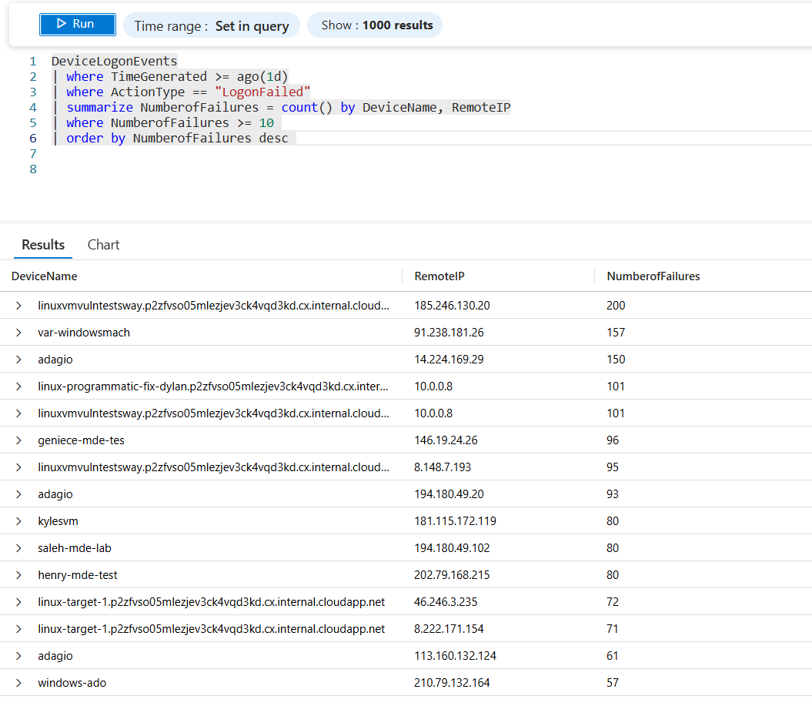
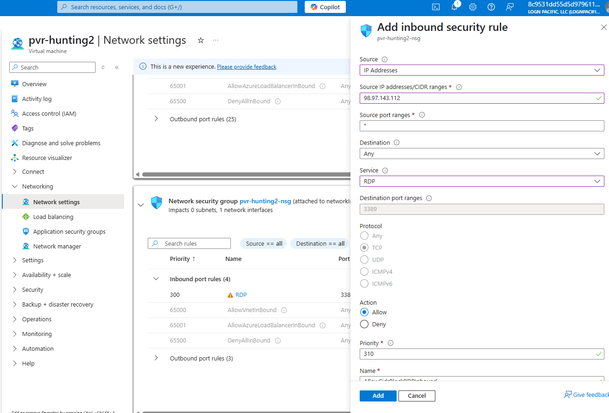
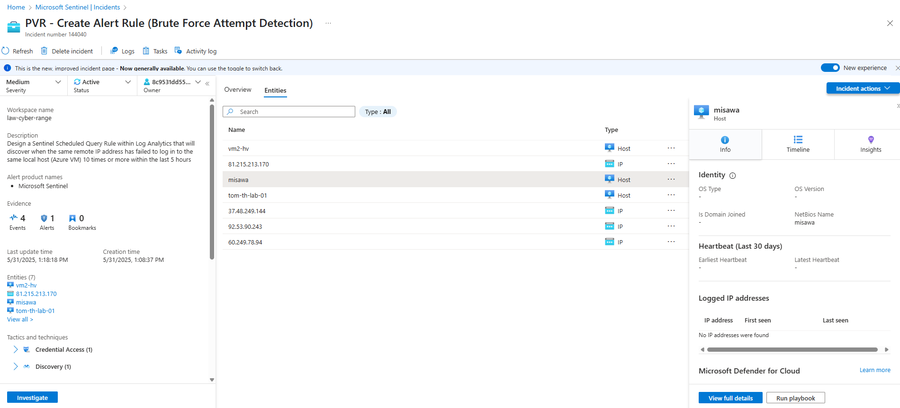
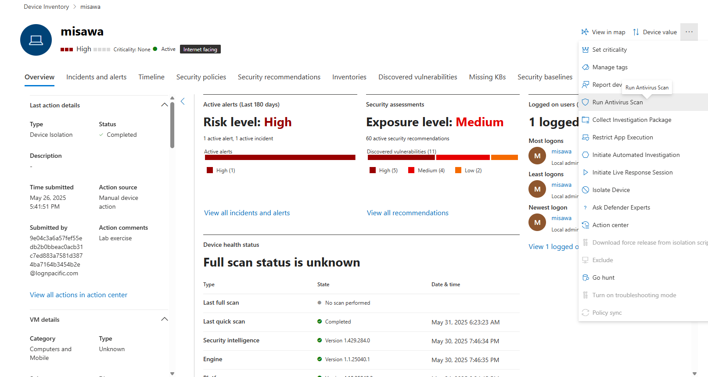
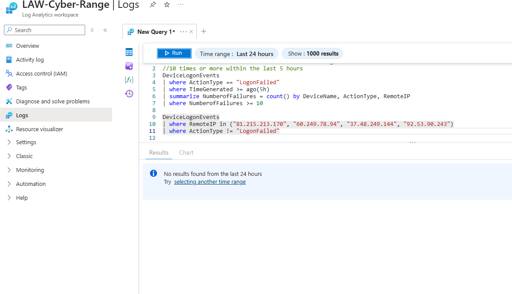
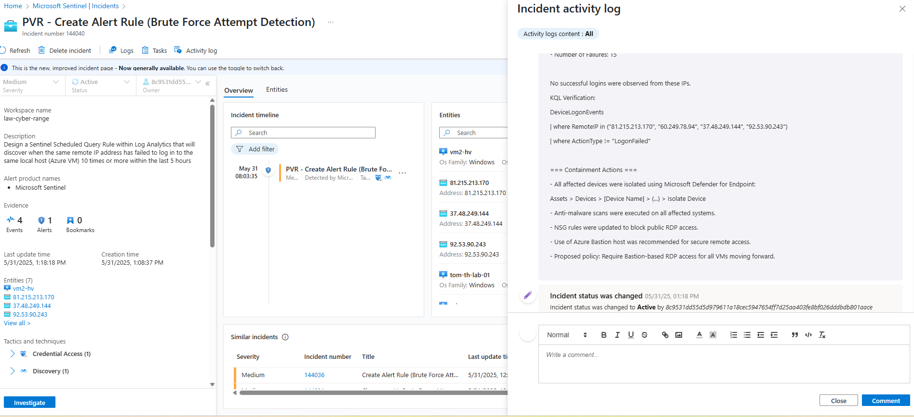
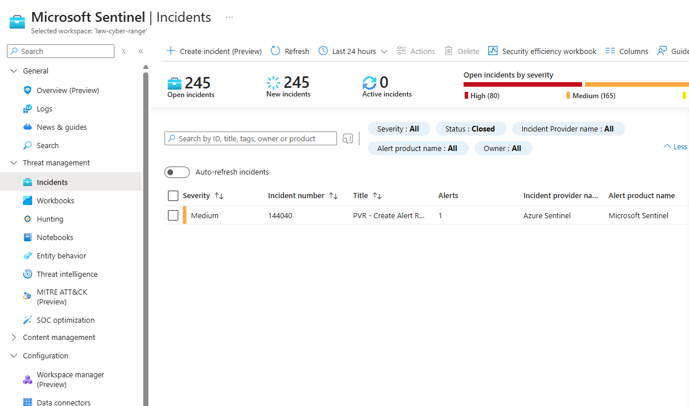

# 🔐 Brute Force Detection with Microsoft Sentinel

This lab demonstrates the implementation of a brute force detection capability in Microsoft Sentinel, aligned with the incident response lifecycle as defined in NIST Special Publication 800-61 Revision 2: *Computer Security Incident Handling Guide*. The activity focuses on the detection and initial response phases, simulating a scenario in which an adversary attempts unauthorized access via repeated failed logon attempts from a single remote IP address.

---

## 🧭 Objective

The objective of this lab is to establish proactive monitoring within Microsoft Sentinel to detect and analyze brute force activity. The detection mechanism uses Kusto Query Language (KQL) to identify excessive failed logon attempts, and a scheduled analytics rule to generate alerts and incidents for further triage and response.

---

## 🛠️ Tools & Environment

- **SIEM Platform**: Microsoft Sentinel
- **Log Source**: Azure Log Analytics (DeviceLogonEvents table)
- **Query Language**: Kusto Query Language (KQL)
- **Threat Framework Reference**: MITRE ATT&CK – T1110 (Brute Force)

---

## 1. 🧰 Preparation (NIST IR Step 1)

As part of the preparation phase, ensure the following controls and logging mechanisms are in place:

- Microsoft Defender for Endpoint is integrated with Microsoft Sentinel.
- Logging is enabled for sign-in events, including successful and failed logon attempts.
- Sentinel workspace is properly configured with an Analytics Rules engine and connected log sources.
- Access permissions are established for creating and managing scheduled query rules.

---

## 2. 🔎 Detection and Analysis (NIST IR Step 2)

In this stage, we define a query to detect brute force attempts based on repeated failed logins and then configure an alert rule to automate detection.

### 📊 KQL Detection Logic

```kql
DeviceLogonEvents
| where ActionType == "LogonFailed"
| where TimeGenerated >= ago(5h)
| summarize NumberofFailures = count() by DeviceName, RemoteIP
| where NumberofFailures >= 10
```

This query filters for logon failures (`ActionType == "LogonFailed"`) within a 5-hour window. It then groups the results by `DeviceName` and `RemoteIP`, counting the number of failures. If 10 or more failures are observed from a single remote IP to a single host, this suggests potential brute force behavior.

### 🛎️ Scheduled Analytics Rule Configuration

| **Field**             | **Value**                              |
|-----------------------|----------------------------------------|
| Rule Name             | Brute Force Detection – Failed Logins  |
| Rule Type             | Scheduled query                        |
| Frequency             | Every 5 hours                          |
| Lookup Period         | Last 5 hours                           |
| Trigger Threshold     | Number of results >= 10                  |
| Severity              | Medium                                 |
| MITRE Tactic          | Credential Access                      |
| MITRE Technique       | T1110 – Brute Force                    |
| Entity Mappings       | `DeviceName`, `RemoteIP`, `AccountName` | 
<br>

### 📈 Log Query Validation in Log Analytics
The query was validated in Log Analytics to confirm accurate detection patterns before rule deployment.



<br>

### 📈 Create New Scheduled Rule - Sentinel Analytics 
Created a new scheduled analytics rule in Microsoft Sentinel for brute force detection based on the above Log Analytics rule.



---

## 3. 🚨 Containment, Eradication, and Recovery (NIST IR Step 3)

Once the rule is triggered, an incident is automatically created in Microsoft Sentinel. This serves as the point of handoff from detection to incident response.

### 🔗 Incident Generation

An alert is fired when matching events are found, leading to the generation of a Sentinel incident that includes contextual information such as host, IP address, and account name.



### 🧩 Triage and Entity Context

Incident details provide visibility into:
- Affected endpoint (`DeviceName`)
- Suspected source of attack (`RemoteIP`)
- Targeted user account (`AccountName`)

  

---



This correlation supports accurate scoping and impact analysis, enabling the security analyst to prioritize containment actions (e.g., isolating the host, blocking the IP).

---

## 4. 📋 Post-Incident Activity (NIST IR Step 4)

Following containment and validation, incident handlers should document findings, response actions, and outcome.

### 📝 Commenting and Documentation

All observations and decisions made during the incident lifecycle can be logged within Sentinel’s Activity Log.



### 🗃️ Closing the Incident

Once fully investigated, the incident can be closed with a resolution reason, marking the completion of the investigation lifecycle.



---

## 📌 Summary

This lab demonstrated how to:

- Prepare a cloud-native SIEM environment for incident detection.
- Implement a KQL-based brute force detection query.
- Automate alerting through Microsoft Sentinel scheduled rules.
- Analyze and respond to incidents in alignment with the NIST IR lifecycle.

This workflow supports the development of an efficient and repeatable detection and response capability, applicable to enterprise-level incident response programs.

> 🔁 Return to [Main Repository README](../README.md) to explore additional incident response labs.

