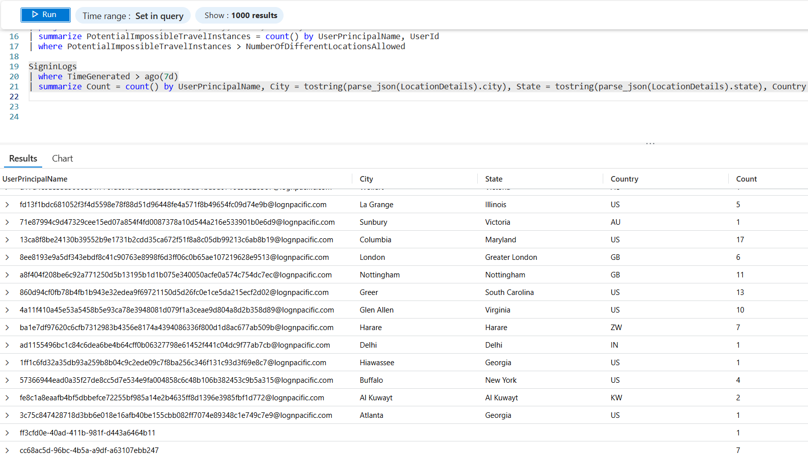
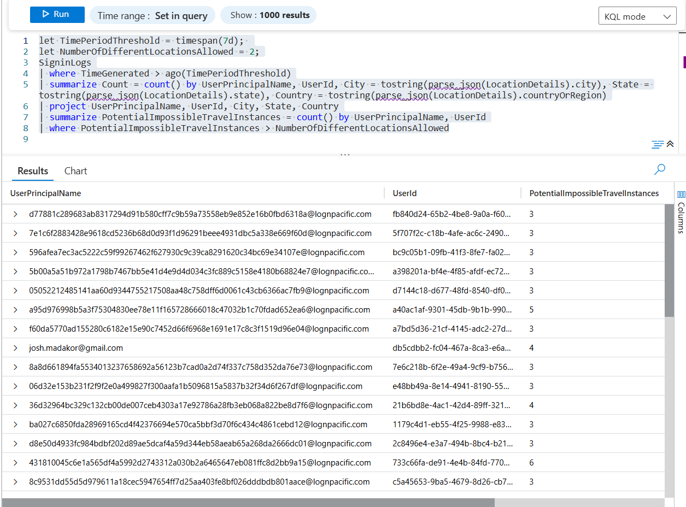
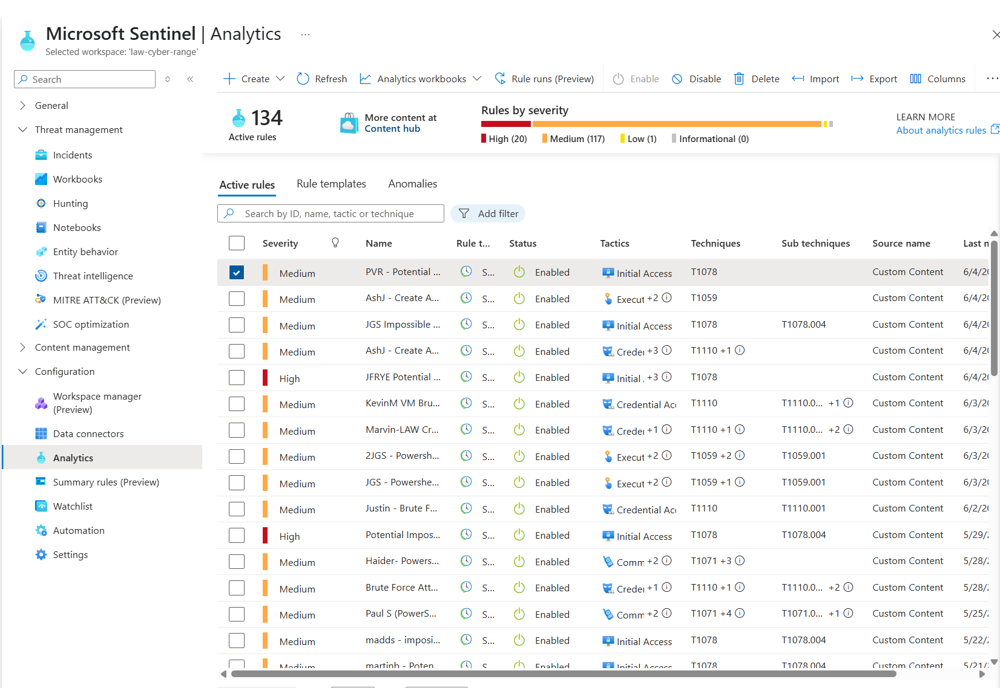
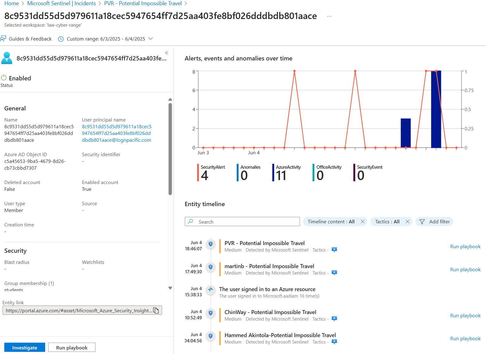
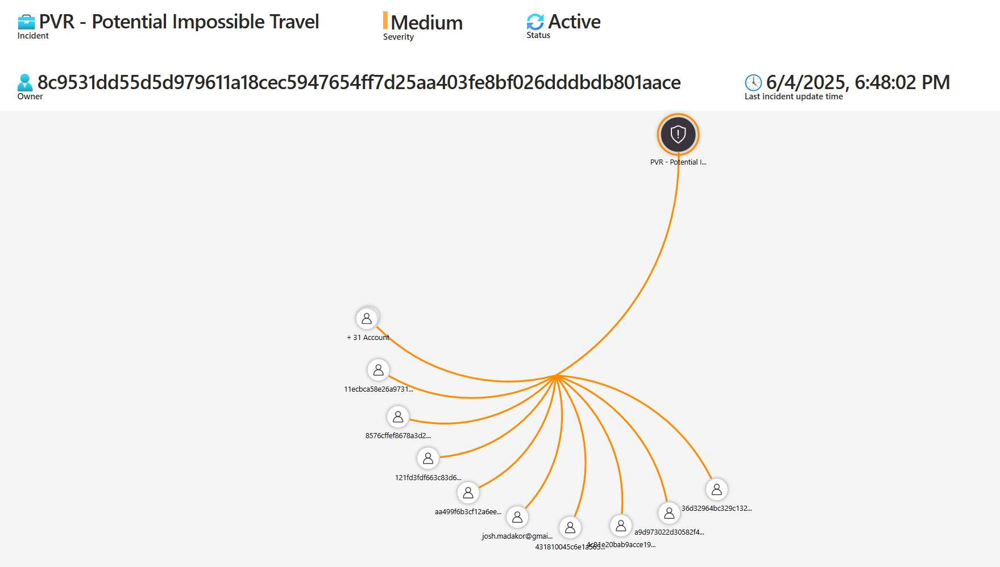
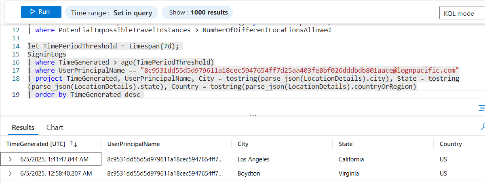
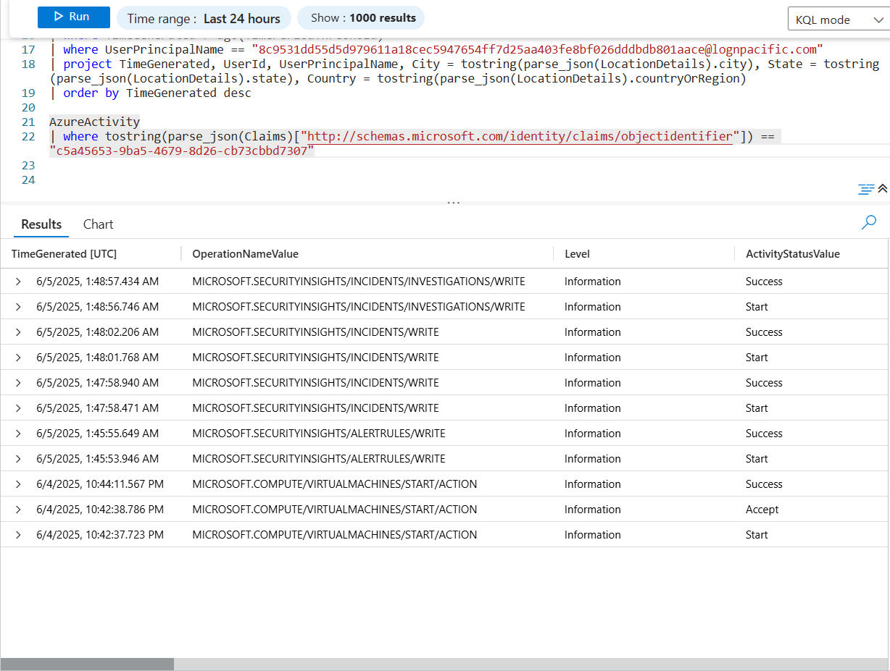

# 🌍 Impossible Travel Detection with Microsoft Sentinel

This lab simulates the detection and investigation of **impossible travel events**—instances where a user logs in from geographically distant locations within a short timeframe, violating realistic physical travel capabilities. It follows the **NIST 800-61 Incident Response Lifecycle** and leverages **Microsoft Sentinel** and **Log Analytics** to identify and triage potentially compromised accounts.

---

## 🎯 Objective

- Detect anomalous logon behavior such as impossible travel using Microsoft Sentinel  
- Build a KQL query and scheduled analytics rule to automate detection  
- Investigate suspicious activity in Microsoft Sentinel  
- Contain potential threats and validate outcomes  
- Document findings and follow NIST-aligned response steps  

---

## 1. 🧰 Preparation (NIST IR Step 1)

Organizations often prohibit:
- Logging in from outside approved geographic regions  
- Account sharing  
- Use of personal or non-corporate VPNs  

These policies reduce the likelihood of account compromise and unauthorized access. In this lab, we simulate a user account logging in from **Virginia** and **California** within a **43-minute window**, which is physically impossible and strongly indicative of account misuse or credential compromise.

Azure sign-in data is collected in the `SigninLogs` table and sent to **Log Analytics**, where **Microsoft Sentinel** consumes it to generate incidents via scheduled query rules.

---

## 2. 🔎 Detection and Analysis (NIST IR Step 2)

### 🔍 Initial Log Review in Log Analytics

To begin, I reviewed logon patterns for unusual geographic activity. A simple KQL query helps visualize where and when users authenticated:

```kusto
SigninLogs
| where TimeGenerated > ago(7d)
| summarize Count = count() by UserPrincipalName, City = tostring(parse_json(LocationDetails).city), State = tostring(parse_json(LocationDetails).state), Country = tostring(parse_json(LocationDetails).countryOrRegion)
```
<br>



---

Then I developed (using ChatGPT) the full query to:
- Look at sign-in events within the past 7 days,
- Group the sign-ins by user and location,
- Keep only the relevant fields (summarize),
- and finally count how many distinct locations each user logged in from.
<br>

```kusto
let TimePeriodThreshold = timespan(7d); 
let NumberOfDifferentLocationsAllowed = 2;
SigninLogs
| where TimeGenerated > ago(TimePeriodThreshold)
| summarize Count = count() by UserPrincipalName, UserId, City = tostring(parse_json(LocationDetails).city), State = tostring(parse_json(LocationDetails).state), Country = tostring(parse_json(LocationDetails).countryOrRegion)
| project UserPrincipalName, UserId, City, State, Country
| summarize PotentialImpossibleTravelInstances = count() by UserPrincipalName, UserId
| where PotentialImpossibleTravelInstances > NumberOfDifferentLocationsAllowed
```



---

### ⚙️ Sentinel Scheduled Analytics Rule

Next I defined a rule that triggers if a user logs in from more than two distinct locations within a 7-day period:




Once implemented, this rule generated an incident for further investigation.

---

### 📥 Incident Alert in Sentinel

After detection, Microsoft Sentinel generated an incident based on our scheduled rule. The alert includes user identity, timestamps, and geolocation metadata. Then following steps were taken in Sentinel:
- Incident Automatically Created
- Incident assigned to self
- Status Active
- Invesitage designation started

<br><br>

---

### 🎯 Flagged Users Visualization

I then created a visualization using Microsoft Sentinel to see the relationships of flagged results.



---

### 🔎 Focused User Review

40 accounts were flagged by the detection logic. One of particular interest was:

**User:** `8c9531dd55d5d979611a18cec5947654ff7d25aa403fe8bf026dddbdb801aace@lognpacific.com`

We ran the following query to assess logins for this specific account:

```kusto
let TimePeriodThreshold = timespan(7d); 
SigninLogs
| where TimeGenerated > ago(TimePeriodThreshold)
| where UserPrincipalName == "8c9531dd55d5d979611a18cec5947654ff7d25aa403fe8bf026dddbdb801aace@lognpacific.com"
| project TimeGenerated, UserPrincipalName, City = tostring(parse_json(LocationDetails).city), State = tostring(parse_json(LocationDetails).state), Country = tostring(parse_json(LocationDetails).countryOrRegion)
| order by TimeGenerated desc
```

**Findings:**

| Timestamp                  | Location       |
|----------------------------|----------------|
| 6/5/2025, 1:41:47 AM       | Los Angeles, CA, US |
| 6/5/2025, 12:58:40 AM      | Boydton, VA, US     |



✅ **Conclusion**: 43 minutes between logins in California and Virginia confirms impossible travel.

---

## 3. 🚨 Containment, Eradication, and Recovery (NIST IR Step 3)

### 🛡️ Incident Response Actions

- **User account disabled** in Entra ID  
- Labeled as a **True Positive** incident  
- No signs of lateral movement found

To further contain possible malicious follow-up behavior, I queried related Azure activity:

```kusto
AzureActivity
| where tostring(parse_json(Claims)["http://schemas.microsoft.com/identity/claims/objectidentifier"]) == "c5a45653-9ba5-4679-8d26-cb73cbbd7307"
```



No suspicious or unauthorized activity was identified beyond the initial anomaly.

---

## 4. 📋 Post-Incident Activity (NIST IR Step 4)

### 🛠️ Lessons Learned & Recommendations

- **Policy Considerations**:  
  While geo-fencing cannot be enabled in the current environment, it’s highly recommended in enterprise deployments to restrict authentication by country or region.

- **Logging Enhancements**:  
  Consider creating a dashboard to continuously monitor anomalous travel patterns.

- **User Awareness**:  
  Educate users about risks of VPN usage, account sharing, and credential security.

- **Documentation**:  
  Add incident findings and actions to the Sentinel case record for future reference.

---

## ✅ Closure

- Reviewed and confirmed incident as a **True Positive**  
- No additional risk detected post-isolation  
- Final classification: **Benign Positive**  
- Case was documented and closed in Sentinel  
- All required NIST IR lifecycle steps were followed

---

*This lab demonstrates how to detect and investigate suspicious authentication behavior using Microsoft Sentinel and KQL, following the structured NIST Incident Response framework to guide investigation, containment, and resolution.*
